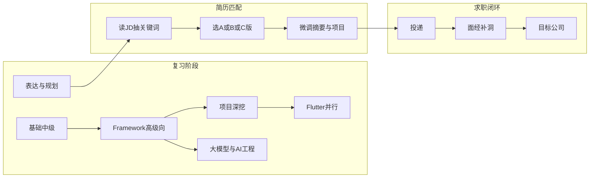

# android_面试

个人 Android 面试与知识整理仓库。

---

## 一、面试准备流程

用于：**复习节奏**、**多版本简历与投递**、**六块知识清单**、**项目 STAR 备忘**。与 [`祝明的简历.md`](祝明的简历.md) 中的公司名、项目名请保持事实一致。时间线约定：**人马互动 2024 年 9 月离职** → **扶摇 2024 年 12 月入职至 2026 年 2 月离职**。

### 1.1 总节奏（可按 4～8 周伸缩）

在职可拉长为 8 周+；离职冲刺可压到 4 周，但 Framework 与项目深挖不可省。

- [ ] **每周结构（示例）**  
  - 上午：**深度块**（Android Framework、或扶摇/车载项目复盘）  
  - 下午：**广度块**（Java/Kotlin 基础、Flutter、或刷题）  
  - 晚间：**30～60 分钟**（当日错题/面经关键词补洞）

- [ ] **并行关系**：阶段三（项目）与阶段一、二穿插进行，避免「全部看完再讲项目」。

### 1.2 多版本简历与 JD 匹配

**原则**：履历事实一份母版；按岗位调整 **摘要、项目顺序、技能栏权重、bullet 关键词**。投递前用 JD 做约 **5 分钟** 微调。

#### 版本划分

| 版本 | 适用岗位 | 摘要与排序侧重 |
|------|----------|----------------|
| **A** | 大模型 / AI 应用 / AI 工程 | 扶摇三段前置；强调 **移动端全链路 + FFmpeg/美摄、漫剧生成体验**；**大模型与厂商 API 在后端**，面试时明确 **Android 职责与后端分工**；**Flutter + AI**、AI 辅助开发（与 JD 对齐） |
| **B** | 车载 / 座舱 / 多媒体 / 语音 | 摘要突出 **车机语音、音频、播放器 SDK**；项目前置 **四维语音助手、音乐 SDK、车悦宝、航盛语音 SDK** 等；扶摇可压缩为一句「AI 多媒体应用」或后置 |
| **C** | 通版 Android 高级 | 母版或从 A/B 裁剪；平衡业务与架构，按 JD 微调 |

#### 投递前 checklist（每次勾选）

- [ ] 从 JD 抽取 **5～10 个关键词**（技术栈 + 业务词）
- [ ] 选定版本 **A / B / C**
- [ ] 改 **摘要** 1～2 句，嵌入其中 3～5 个关键词
- [ ] 必要时 **调换 1～2 个项目**顺序
- [ ] 改 **3～5 条**项目 bullet：动词 + 关键词与 JD 对齐（量化数据只写真实值）

**导出文件命名示例（本地）**：`简历_AI_Flutter.pdf`、`简历_车载语音.pdf`、`简历_Android_通版.pdf`。

### 1.3 阶段一：语言与 Android 基础（目标：中级）

- [ ] **Java**：集合与并发（JUC）、内存模型、类加载、反射与注解、OOM/GC 等概念能讲清边界
- [ ] **Kotlin**：协程与作用域、inline/reified、与 Java 互操作、空安全与扩展函数
- [ ] **Android 应用层**：四大组件与生命周期、Handler/Looper、View 绘制与事件、RecyclerView、存储与权限、进程与多进程基础
- [ ] **C / NDK（按需）**：JNI、so 加载、常见 native crash 排查思路（与音视频/车载 native 衔接）

### 1.4 阶段二：Android Framework（目标：高级向）

- [ ] **启动与组件**：SystemServer 启动脉络、AMS、Activity 启动链路（概念 + 关键类）
- [ ] **WMS / 显示**：窗口与 Surface 基本概念、卡顿与刷新相关常识
- [ ] **Binder / AIDL**：原理与使用场景、系统服务获取方式
- [ ] **Input、ANR**：输入分发常识、ANR 类型与排查思路（应用 + 系统侧常识）
- [ ] **音频子系统（概念级）**：AudioFlinger、AudioPolicy、AudioTrack/路由与焦点 —— 能结合车机/播放器项目说明「边界」，不深背源码

### 1.5 阶段三：项目深挖

准备每条故事线时，尽量覆盖：**业务背景 → 你负责的技术点 → 原理 → 踩坑 → 数据/指标（真实）**。

#### 近期：深圳扶摇科技有限公司（2024 年 12 月 ～ 2026 年 2 月）

- [ ] **AI 应用 · 小说转漫画（音视频合成）**  
  - 图片/音频处理，合成视频；**FFmpeg**（字幕、标题、封面、图片或视频替换、滤镜、特效）；**美摄 SDK**  
  - 独立功能：**封面制作、直播切片、视频翻译**  
  - STAR：最难链路、SDK 与 FFmpeg 协作、性能或兼容问题（填你的真实案例）

- [ ] **同声传译**  
  - 语音通话：**深网 SDK**；翻译：**微软翻译**  
  - STAR：延迟、弱网、鉴权或计费、异常重试（按实际）

- [ ] **AI 应用 · 视频生成 / AI 漫剧**  
  - 角色、背景、分镜、视频生成等流程  
  - 商业模型：**阿里通义千问、字节火山、Sora** 等 —— 准备 **移动端**如何对接业务接口、状态机、结果展示、轮询/推送、异常与重试；**模型与厂商 API 属后端**，能讲清协作边界即可

#### 历史车载 / 语音（与 `祝明的简历.md` 对齐，便于版本 B）

- [ ] **北京四维智联 · 语音助手**：模块化架构、语音引擎（云之声/普强）、唤醒/识别/语义/TTS、UI 框架、状态机流程、NDK TCP 等 —— 各挑 1 个深挖
- [ ] **北京四维智联 · 音乐项目**：播放器 SDK、AIDL 与 launcher/app 双端、播放控制与流程
- [ ] **深圳弘范 · 车悦宝**：框架、AIDL 播放、插件化/热修复、与方案商对接
- [ ] **航盛 · 车载语音助手 SDK**：语义、业务 API、唤醒/识别/TTS 封装、多客户接入
- [ ] 其他：云图家居语音助手、人马互动各语音/鸿蒙项目 —— 按目标 JD 选 1～2 个备 STAR

**面试常勾连点**：音频焦点、多音区/路由（知道多少讲多少）、ASR 链路、回声消除/降噪（概念 + 你是否在项目中碰过）

### 1.6 阶段四：Flutter

- [ ] Dart 语言要点、Widget 与 **状态管理**（写你真实用过的方案）
- [ ] Platform Channel、与 Android 混合栈、工程结构
- [ ] 性能、包体积、常见坑（按 JD 决定是否加深）

**排期**：若 JD 中 Flutter 权重低，可放在周末块或与阶段一并行。

### 1.7 阶段五：大模型与 AI 编程

- [ ] **使用层**：Prompt 规范、AI 辅助编码与 Review 流程、敏感信息与密钥边界
- [ ] **原理层（2～3 分钟能讲完）**：Transformer/Tokenizer 粗浅、RAG 流程、Agent 与工具调用（按需）
- [ ] **结合经历**：扶摇漫剧/生成管线 **Android 全链路**；大模型与厂商对接在 **后端**，面试与简历一致；端侧推理若做过再写

### 1.8 阶段六：自我介绍、优点、未来规划

- [ ] **1 分钟版**：我是谁 + 最近一段核心贡献 + 1 个技术关键词
- [ ] **3 分钟版**：上述 + **STAR 项目 1～2 个**（扶摇或车载，投谁带谁）
- [ ] **优点**：每条尽量带 **可验证证据**（性能数据、交付结果、协作案例）
- [ ] **规划**：**6 个月**（技能补全）+ **1～3 年**（方向与岗位对齐：Framework / 多媒体 / Flutter / AI 工程）

### 1.9 投递与反馈闭环

- [ ] **第一步**：Java / Android 基础与框架原理至少过一轮（与阶段一、二 checklist 对齐）
- [ ] **第二步**：按 **「多版本简历与 JD 匹配」** 选好简历版本，整理简历后先投递部分小公司/目标池边缘岗位，收集反馈
- [ ] **第三步**：根据面试与 JD 反馈，回到阶段一～五 **定点补洞**
- [ ] **第四步**：投递更感兴趣或更匹配的公司（继续用 A/B/C 微调）
- [ ] **第五步**：若仍未落定，适当放宽岗位标签，**有面试就去**，持续迭代话术与薄弱点

### 1.10 附录：仓库内参考资料

- [ ] [`res/2024知识整理/`](res/2024知识整理/)：xmind 等知识梳理（Java、Android 面试题等）
- [ ] [`res/2024知识整理/面试相关问题.txt`](res/2024知识整理/面试相关问题.txt)：面试问题备忘
- [ ] [`祝明的简历.md`](祝明的简历.md)：对外简历事实源；更新工作经历时注意与本章 **扶摇 / 车载项目**小结一致

---

*复习进度可自行勾选 checklist；祝面试顺利。*
